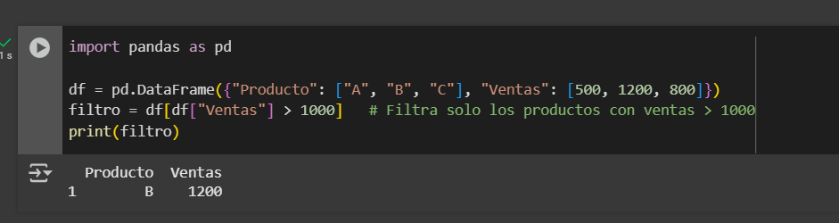
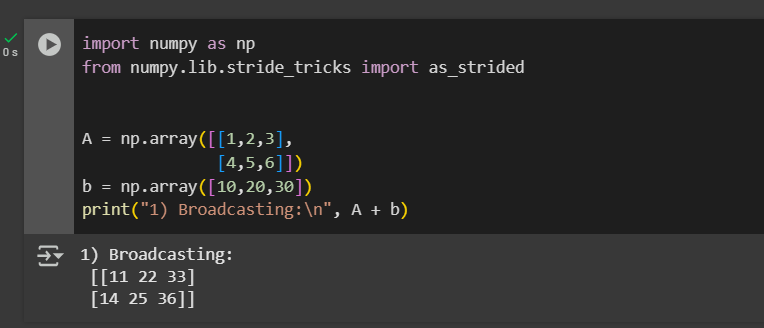

  A. Numpy arreglos

    Como primer paso veremos que son los arreglos y como se pueden aplicar, de esta forma entenderemos para que son y explicaremos de que forma estos se pueden utilizar en difernetes contextos.

    Los arreglos basicamente son una estructura por la que obtendremos formas diversas en las que podremos almacenar datos del mismo tipo, vale la pena mencionar que estas colecciones de datos son sumamente eficientes tanto en su creacion como en su almacenamiento.

    existen dos tipos, vectores y matrices.
    Cada uno de ellos tiene ciertas cualidades y  caracteristicas; por ejemplo los vectores son tecnicamente matrices, sinembargo tienen 1D, asi que se podria decir que son pseudo matrices que pueden ser creadas de manera vertical u horizontal según se desee, las matrices como tal tienen 2D, ahi radica su principal diferencia.
    
    Para empezar vamos a hablar de lo mas básico de la libreria numpy, lo cual es el modo en el que se va a importar la propia libreria, es sumamente sencillo, haremos uso de una simple linea de codigo
    
    * import numpy as np
    Esta simple lina de codigo importa una gran herramienta, nos ahorrará algunos si no muchos dolores de cabeza. en caso que quieras conocer la versión de numpy, debemos usar otra simple linea de codigo.
    * np.__version__

    EJEMPLO 1°

    en este caso podemos ver que la version que fue importada es la 2.0.2

  los arreglos pueden ser creados a partir de la conversion de una lista o una lista que contenga listas, por ejemplo
  * my_list = [1, 2, 3]
  * my_list

  mediante el metodo array es posible convertir una lista a un arreglo, con este metodo, podemos tambien asignar el arreglo a un tipo de dato, por otro lado el comando "a.dtipe" nos permite conocer el tipo de datos que tiene el arreglo, ademas podemos mostrar que efectivamente el dato del arreglo "a" fue guardado

  * a = np.array(my_list)
  * type(a)
  * a.dtype 
  * print(a)

_______________________________________________________________________________________________________

PANDAS Y SUS OPERAACIONES AVANZADAS
¿QUE ES PANDAS?

 Pandas es una librería de Python muy poderosa para el análisis y manipulación de datos.
 Permite trabajar con DataFrames (tablas de datos con filas y columnas) de forma sencilla, similar a Excel o SQL, pero con la potencia de Python.

 Con Pandas puedes:

 -Limpiar datos (quitar nulos, duplicados, etc.).

 -Transformar y organizar información.

 -Hacer análisis estadístico.

 -Exportar e importar a distintos formatos (CSV, Excel, SQL, JSON).

  *Filtros (Filtering)

Qué es: Seleccionar filas o columnas que cumplen una condición.

Uso: Permite trabajar solo con los datos relevantes.

  *GroupBy

Qué es: Agrupar datos según una o varias columnas y aplicar funciones de agregación.

Uso: Sirve para análisis estadístico, como totales, promedios, conteos.

   *Merge / Join

Qué es: Combinar dos DataFrames según columnas en común (similar a JOIN en SQL).

Uso: Integrar información de distintas tablas en una sola.

    1-2.
_______________________________________________________________________________________________
C. Pandas, Dataframes y Series

En un contexto de manipulacion de datos nos damos cuenta de que es una de las tareas mas importantes de la ciencia de datos, analisis estadistico y la inteligencia artificial. Mientras los conjuntos de datos se vuelven mas grandes y complejos, surge una necesidad de utilizar diferentes herramientas que nos permitan gestionar de una manera mas eficiente, rapida y flexible. 

En este contexto, Pandas se ha convertido en una de las librerias que mas se utilizan en Python. Su nombre proviene de Panel Data (datos en panel). Pandas ofrece estructuras de datos y funciones diseñadas especificamente para trabajar con informacion que esta organizada en diferentes filas y columnas que son similares a hojas de calculo en excel o tablas de bases de datos. 

Ventajas de Pandas: 
-Cargar y exportar diferentes datos en multiples formatos como : CSV, Excel, JSON, SQL, entre otros. 
-Nos ofrece estructuras de datos como Series y Dataframes que nos facilitan la organizacion y el analisis de los datos.
-Facilita la limpieza, transformacion y manipulacion de datos. 
-Se integra con otras librerias como NumPy, Matplotlib y Scikit-learn, lo que hace que esta herramienta sea indispensable en proyectos de analisis de datos. 

Series en Pandas: 
Una Serie en pandas es una estructura de datos unidimensionales como numeros, cadenas de texto, valores booleanos, fechas y otro tipo de informaciones. 
Lo mas importante de las Series en pandas es que cada uno de sus elementos esta asociado a un indice, lo cual funciona como una etiqueta que identifica y da un acceso rapido a cada valor. 

Caracteristicas principales de las Series: 
-Son unidimensionales. 
-Cada uno de sus elementos esta ligado a un indice. 
-Pueden almacenar diferentes tipos de datos. 
-Son importantes para trabajar con listas de datos que requieren una identificacion clara. 

Creacion y manipulacion de Series: 

Ejemplo 1: Crear una Serie desde una lista. 

 
Ejemplo 2: Serie con índices personalizados. 

Ejemplo 3: Serie a partir de un diccionario. 

Ejemplo 4: Serie con valores booleanos. 

Ejemplo 5: Serie con datos numéricos generados automáticamente. 

Dataframes en Pandas: 
El Dataframe es la estructura mas potente y utilizada en Pandas. Es una tabla bidimensional con filas y columnas, donde cada una de las columnas puede contener un tipo de dato distinto.
Cada fila contiene un indice que la identifica, y cada columna tiene un nombre que permite acceder a los datos de forma sencilla. Esto hace que el Dataframe sea una herrameinta muy importante para el analisis de datos tabulares. 

Caracteristicas principales de Dataframes: 
-Son bidimensionales. 
-Cada columna es la realidad de una Serie de Pandas. 
-Se admiten multiples tipos de datos en diferentes columnas. 
-Permiten operaciones de seleccion, filtrado, ordenamiento, agrupacion y combinacion de datos. 
-Pueden cargarse desde diferentes fuentes externas como CSV, Excel o bases de datos. 
Gracias a los Dataframes, Pandas permite estructurar grandes volumenes de informacion y aplicar sobre ellos operaciones estadisticas, matematicas o de transformacion con muy pocas lineas de codigo. 

Creación y manipulación de DataFrames: 

Ejemplo 1: Crear un DataFrame desde un diccionario. 

Ejemplo 2: Selección de columnas. 

Ejemplo 3: Seleccionar varias columnas. 

